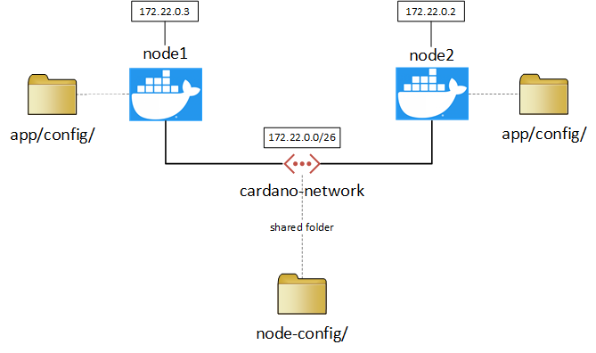
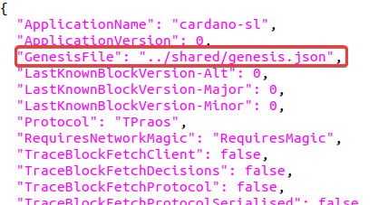
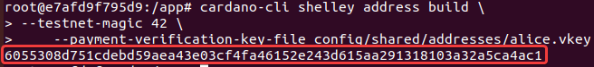

# Create your own Shelley private testnet with Docker
This tutorial is based on the next excellent instruction from IOHK: https://github.com/input-output-hk/cardano-node/blob/master/doc/shelley-genesis.md
This tutorial will highlight only the steps to create your own private testnet. For more details please check out IOHK instruction.

**NOTE**: if the image is too small to see the details, then you can right-click on the image and select *Open image in new tab*. The original image version will be shown in a separate tab.

## Prerequisite
* Docker and Docker Compose are installed, which can be downloaded from: https://docs.docker.com/get-docker/
* This tutorial is written for Linux, but it should work for Windows and Mac OS as well. You might need to adjust the Docker commands.

## Prepare and run Docker containers
We make use of Docker to create the nodes for our private testnet:
1. Clone or download this Git repository;
2. Open the command line and go to the subdirectory ```script/```;
3. Run the next command. It will take a while to download and build the source codes from the ```master``` branch (approxiately 30 minutes depending on your computer speed). So take a break and be patient.
   ```
   docker-compose up -d
   ```
4. If there is no build error, then you can run the command:
   ```
   docker ps
   ```
5. It will show 2 running containers: ```node1``` and ```node2```


6. Alright, here is the plan. We have started 2 containers and they are connected via the private network ```cardano-network```. ```node1``` has the IP address ```172.22.0.3```, and ```node2``` has the IP address ```172.22.0.2```. If you want to have a different IP range, then you need to change the settings in the file ```docker-compose.yml```.
   Both containers will make use of the shared folder ```node-config/```



1. Open a new terminal and connect to ```node1``` with the next command:
```
sudo docker exec -it node1 bash
```

## Steps overview

We will execute the next steps to prepare and create our Shelley private testnet:
1. Generate the default folders and files;
2. Generate the genesis keys;
3. Generate the genesis delegate keys;
4. Create the initial UTxO keys;
5. Prepare the nodes.


### Generate the default folders and files

After connected to the Bash shell of ```node1```, we will make use of the next CLI command to generate the default folders and files. In this example we have defined ```config/shared/``` as our template directory name.

```
$ cardano-cli shelley genesis create --genesis-dir config/shared/ --testnet-magic 42
```
It will generate the next folders and files:


* **genesis.json**: contains the genesis configuration for our private testnet.
* **genesis.spec.json**: is the genesis template to generate *genesis.json*. The ```create``` will read the *genesis.spec.json* and produce the *genesis.json* by filling in the:
  * genDelegs
  * initialFunds
  * startTime
  * and optionally it can override the maxLovelaceSupply

### Generate the genesis keys
Run the next command to generate the genesis keys. In this example we have generated 2 genesis keys.
```
$ cardano-cli shelley genesis key-gen-genesis \
    --verification-key-file config/shared/genesis-keys/genesis1.vkey \
    --signing-key-file config/shared/genesis-keys/genesis1.skey

$ cardano-cli shelley genesis key-gen-genesis \
    --verification-key-file config/shared/genesis-keys/genesis2.vkey \
    --signing-key-file config/shared/genesis-keys/genesis2.skey
```

* **.vkey** is the public verification key.
* **.skey** is the private signing key.


### Generate the genesis delegate keys
Next we need to make genesis delegate keys with the next command. These are the operator offline/cold keys.
```
$ cardano-cli shelley genesis key-gen-delegate \
    --verification-key-file config/shared/delegate-keys/delegate1.vkey \
    --signing-key-file config/shared/delegate-keys/delegate1.skey \
    --operational-certificate-issue-counter config/shared/delegate-keys/delegate-opcert1.counter

$ cardano-cli shelley genesis key-gen-delegate \
    --verification-key-file config/shared/delegate-keys/delegate2.vkey \
    --signing-key-file config/shared/delegate-keys/delegate2.skey \
    --operational-certificate-issue-counter config/shared/delegate-keys/delegate-opcert2.counter
```


### Generate the initial UTxO keys
The genesis file can list number of initial addresses and values, but we need keys for those addresses and later to sign transactions to spend the initial UTxO values. So we need to make genesis initial UTxO keys with next command:
```
$ cardano-cli shelley genesis key-gen-utxo \
    --verification-key-file config/shared/utxo-keys/utxo1.vkey \
    --signing-key-file config/shared/utxo-keys/utxo1.skey

$ cardano-cli shelley genesis key-gen-utxo \
    --verification-key-file config/shared/utxo-keys/utxo2.vkey \
    --signing-key-file config/shared/utxo-keys/utxo2.skey
```


### Prepare the nodes
Alright now we have prepared the key ingredients for our private testnet. It's time to do some fun stuff: create the nodes and start our private testnet.

Our nodes need the operational/hot keys to sign block headers. Run the next command to create the KES keys. The KES key is used to prove that the node is who it says it is, just like a normal signature.
```
$ cardano-cli shelley node key-gen-KES \
    --verification-key-file config/node1/kes.vkey \
    --signing-key-file config/node1/kes.skey

$ cardano-cli shelley node key-gen-KES \
    --verification-key-file config/node2/kes.vkey \
    --signing-key-file config/node2/kes.skey
```

Run the next command to generate new VRF keys. The VRF key is used to prove that the node has the right to create a block in this slot.
```
$ cardano-cli shelley node key-gen-VRF \
    --verification-key-file config/node1/vrf.vkey \
    --signing-key-file config/node1/vrf.skey

$ cardano-cli shelley node key-gen-VRF \
    --verification-key-file config/node2/vrf.vkey \
    --signing-key-file config/node2/vrf.skey
```

And finally run the next command to issue the operational certificates, which establish the link between the operator's offline keys and their operational keys.
```
$ cardano-cli shelley node issue-op-cert \
    --hot-kes-verification-key-file config/node1/kes.vkey \
    --cold-signing-key-file config/shared/delegate-keys/delegate1.skey \
    --operational-certificate-issue-counter config/shared/delegate-keys/delegate-opcert1.counter \
    --kes-period 0 \
    --out-file config/node1/cert

$ cardano-cli shelley node issue-op-cert \
    --hot-kes-verification-key-file config/node2/kes.vkey \
    --cold-signing-key-file config/shared/delegate-keys/delegate2.skey \
    --operational-certificate-issue-counter config/shared/delegate-keys/delegate-opcert2.counter \
    --kes-period 0 \
    --out-file config/node2/cert
```


Besides the operational keys, our nodes also need to have the next configuration files:
* **genesis.json**: which we have generated in the previous step.
* **topology.json**: contains the connection information to the other nodes.
* **config.json**: contains the specific settings of a node.

If you open *config.json* in a text editor, then you will see the link to *genesis.json*. If you want to change the genesis file name or path, then *config.json* needs to be updated as well.



Now you should have the next directories, subdirectories and files:

```
./config:
node1
node2
shared

./config/node1:
cert
config.json
kes.skey
kes.vkey
topology.json
vrf.skey
vrf.vkey

./config/node2:
cert
config.json
kes.skey
kes.vkey
topology.json
vrf.skey
vrf.vkey

./config/shared:
delegate-keys
genesis.json
genesis-keys
genesis.spec.json
utxo-keys

./config/shared/delegate-keys:
delegate1.skey
delegate1.vkey
delegate2.skey
delegate2.vkey
delegate-opcert1.counter
delegate-opcert2.counter

./config/shared/genesis-keys:
genesis1.skey
genesis1.vkey
genesis2.skey
genesis2.vkey

./config/shared/utxo-keys:
utxo1.skey
utxo1.vkey
utxo2.skey
utxo2.vkey
```

#### [Optional step] Configure the connection settings in topology.json
If you have changed the predefined IP addresses in the file  ```docker-compose.yml```, then proceed with the next steps. Otherwise continue with the next step [Run the nodes](#runnodes).
Run the next command in the container ```node1```:
```
$ cat /etc/hosts
```
It will return something like this:


The IP address of ```node1``` is shown in the red rectangle, which is ```172.23.0.3``` in this example. Make a note of this IP address. We will need it in the follow-up steps.

Open another terminal and run the command:
```
$ sudo docker exec -it node2 bash
```
Now we are connected to the second container ```node2```. Run the next command:
```
$ cat /etc/hosts
```


Make a note of the IP address of the second container ```node2```, which is ```172.23.0.2``` in this example.

Go back to the terminal of ```node1``` and run the command:
```
$ nano config/node1/topology.json
```
Fill in the address of the second container ```node2```:


Save the file ```topology.json``` (```Ctrl```+```X```, then ```Y```+```Enter```).

Now we need to update the file topology.json of the second container ```node2```. Run the command:
```
$ nano config/node2/topology.json
```
Fill in the address of the first container ```node1``:


Save the file ```topology.json``` (```Ctrl```+```X```, then ```Y```+```Enter```).

#### <a name="runnodes"></a>Run the nodes
Well done so far. We can now have some fun, by starting the nodes.

Generate the genesis configuration and adding some funds:
```
$ cardano-cli shelley genesis create \
    --genesis-dir config/shared/ \
    --supply 8000000000000 \
	--testnet-magic 42
```

We need another terminal with ```node1```. Run the command:
```
$ screen -S executor
```

Run the next command in the new terminal:

```
$ cardano-node run \
    --config config/node1/config.json \
    --topology config/node1/topology.json \
    --database-path db \
    --socket-path db/node.sock \
    --shelley-kes-key config/node1/kes.skey \
    --shelley-vrf-key config/node1/vrf.skey \
    --shelley-operational-certificate config/node1/cert \
    --port 3001
```

It will show up something like this:


Press ```Ctrl```+```a```+```d``` to return the main terminal of ```node1```. Open the terminal of ```node2``` and run the next command:
```
$ cardano-node run \
    --config config/node2/config.json \
    --topology config/node2/topology.json \
    --database-path db \
    --socket-path db/node.sock \
    --shelley-kes-key config/node2/kes.skey \
    --shelley-vrf-key config/node2/vrf.skey \
    --shelley-operational-certificate config/node2/cert \
    --port 3002
```

Congratulations. You have just setup your own private testnet!

## Make some transactions
Run the next command in the main terminal of ```node1```:
```
export CARDANO_NODE_SOCKET_PATH=/app/db/node.sock
```
Then run:
```
$ cat config/shared/genesis.json
```
Make a note of the initial funds addresses:


Check the funds of the first address, which is ```60777fb7fb41e228956772e28578c7181abd39ef33923bd0e46d839327cb484a93``` in this example:
```
$ cardano-cli shelley query utxo \
	--testnet-magic 42 \
	--address 60777fb7fb41e228956772e28578c7181abd39ef33923bd0e46d839327cb484a93
```

```
                           TxHash                                 TxIx        Lovelace
----------------------------------------------------------------------------------------
777fb7fb41e228956772e28578c7181abd39ef33923bd0e46d839327cb484a93     0     4000000000000
```
Make a note of ```TxHash``` and ```TxIx```. We need them to build our transaction.

### Transfer funds to Bob

Generate new keys for Bob with the command:
```
$ mkdir config/shared/addresses

$ cardano-cli shelley address key-gen \
    --verification-key-file config/shared/addresses/bob.vkey \
    --signing-key-file config/shared/addresses/bob.skey
```
Generate a new address for Bob:
```
$ cardano-cli shelley address build \
	--testnet-magic 42 \
    --payment-verification-key-file config/shared/addresses/bob.vkey
```
Take a note of the address, which is ```605415793480acebc5978140a51976f91092a3092203c5d40f07eeb91d16a274cf``` in this example.


Now we can start building the transaction from the initial funds to Bob.

```
$ mkdir config/shared/transactions

$ cardano-cli shelley transaction build-raw \
    --tx-in  777fb7fb41e228956772e28578c7181abd39ef33923bd0e46d839327cb484a93#0 \
    --tx-out 605415793480acebc5978140a51976f91092a3092203c5d40f07eeb91d16a274cf+4000000000000 \
    --ttl 3600 \
    --fee 0 \
    --tx-body-file config/shared/transactions/tx1.txbody
```

**tx-in**: is composed of ```TxHash```#```TxIx```, which is ```777fb7fb41e228956772e28578c7181abd39ef33923bd0e46d839327cb484a93#0``` in this example.

Run the following commands to finalize the transaction:
```
$ cardano-cli shelley transaction sign \
  --tx-body-file config/shared/transactions/tx1.txbody \
  --signing-key-file config/shared/utxo-keys/utxo1.skey \
  --testnet-magic 42 \
  --tx-file config/shared/transactions/tx1.tx

$ cardano-cli shelley transaction submit \
  --tx-file config/shared/transactions/tx1.tx \
  --testnet-magic 42
```

Let's check the funds of Bob:
```
$ cardano-cli shelley query utxo \
	--testnet-magic 42 \
	--address 605415793480acebc5978140a51976f91092a3092203c5d40f07eeb91d16a274cf
```
Bob has now 4000000000000 Lovelace in his address ```605415793480acebc5978140a51976f91092a3092203c5d40f07eeb91d16a274cf```.
```
                           TxHash                                 TxIx        Lovelace
----------------------------------------------------------------------------------------
79ec084a343ba88d6cc9f82c0c4e56cff87f0e7c1655eac264ceea0e803e7076     0     4000000000000
```
### Transfer funds from Bob to Alice

Generate new keys for Alice with the command:
```
$ cardano-cli shelley address key-gen \
    --verification-key-file config/shared/addresses/alice.vkey \
    --signing-key-file config/shared/addresses/alice.skey
```
Generate a new address for Bob:
```
$ cardano-cli shelley address build \
	--testnet-magic 42 \
    --payment-verification-key-file config/shared/addresses/alice.vkey
```
Take a note of her address, which is ```6055308d751cdebd59aea43e03cf4fa46152e243d615aa291318103a32a5ca4ac1``` in this example.



Check her funds:
```
$ cardano-cli shelley query utxo \
	--address 6055308d751cdebd59aea43e03cf4fa46152e243d615aa291318103a32a5ca4ac1 \
	--testnet-magic 42
```
She doesn't have any funds in her address, which was expected:
```
                           TxHash                                 TxIx        Lovelace
----------------------------------------------------------------------------------------
```

Check the transaction fee with the next commands:
```
$ cardano-cli shelley query protocol-parameters \
    --testnet-magic 42 \
    --out-file config/shared/transactions/protocol.json

$ cardano-cli shelley transaction calculate-min-fee \
    --tx-in-count 1 \
    --tx-out-count 2 \
    --ttl 3600 \
    --testnet-magic 42 \
    --signing-key-file config/shared/addresses/bob.skey \
    --protocol-params-file config/shared/transactions/protocol.json
```
The transaction fee is configured as ```0``` in our private testnet.


Determine ```tx-in``` (=```TxHash```#```TxIx```) from Bob's address, which is ```79ec084a343ba88d6cc9f82c0c4e56cff87f0e7c1655eac264ceea0e803e7076#0``` in this example:
```
$ cardano-cli shelley query utxo \
	--testnet-magic 42 \
	--address 605415793480acebc5978140a51976f91092a3092203c5d40f07eeb91d16a274cf
```
```
                           TxHash                                 TxIx        Lovelace
----------------------------------------------------------------------------------------
79ec084a343ba88d6cc9f82c0c4e56cff87f0e7c1655eac264ceea0e803e7076     0     4000000000000
```
Build the transaction:
```
$ cardano-cli shelley transaction build-raw \
	--tx-in 79ec084a343ba88d6cc9f82c0c4e56cff87f0e7c1655eac264ceea0e803e7076#0 \
	--tx-out 6055308d751cdebd59aea43e03cf4fa46152e243d615aa291318103a32a5ca4ac1+4000000000000 \
	--ttl 3600 \
	--fee 0 \
	--tx-body-file config/shared/transactions/tx2.txbody
```
Sign the transaction with Bob's private key:
```
$ cardano-cli shelley transaction sign \
  --tx-body-file config/shared/transactions/tx2.txbody \
  --signing-key-file config/shared/addresses/bob.skey \
  --testnet-magic 42 \
  --tx-file config/shared/transactions/tx2.tx
```
Submit the transaction:
```
$ cardano-cli shelley transaction submit \
  --tx-file config/shared/transactions/tx2.tx \
  --testnet-magic 42
```
Check Bob's funds:
```
$ cardano-cli shelley query utxo \
	--testnet-magic 42 \
	--address 605415793480acebc5978140a51976f91092a3092203c5d40f07eeb91d16a274cf
```
His funds have been transferred to Alice:
```
                           TxHash                                 TxIx        Lovelace
----------------------------------------------------------------------------------------
```
Check Alice's funds:
```
$ cardano-cli shelley query utxo \
	--testnet-magic 42 \
	--address 6055308d751cdebd59aea43e03cf4fa46152e243d615aa291318103a32a5ca4ac1
```
She is now rich :-):
```
                           TxHash                                 TxIx        Lovelace
----------------------------------------------------------------------------------------
750012ebe7fd69f6b699ae2d13d719660a396ae8f091a8c5347d8c24b7a5ebb9     0     4000000000000
```


**Congratulations. Now you have your private testnet to experiment with.**

## Stop your private testnet
Open a new terminal and run the next command to stop your private testnet:
```
docker-compose down
```
