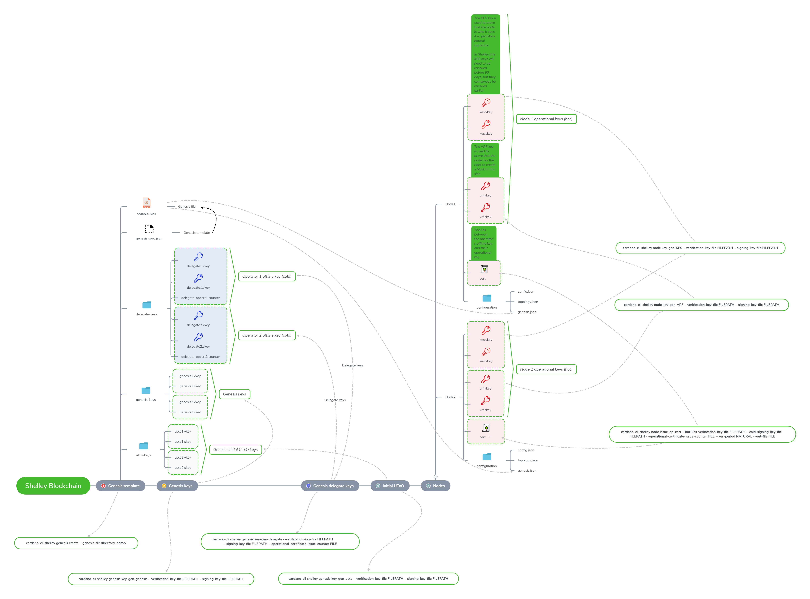

# Create your own Shelley private testnet with Docker
This tutorial is based on the next excellent instruction from IOHK: https://github.com/input-output-hk/cardano-node/blob/master/doc/shelley-genesis.md
This tutorial will highlight only the steps to create your own private testnet. For more details please check out IOHK instruction.

**NOTE**: if the image is too small to see the details, then you can right-click on the image and select *Open image in new tab*. The original image version will be shown in a separate tab.

## Prerequisite
* Docker and Docker Compose are installed, which can be downloaded from: https://docs.docker.com/get-docker/
* This tutorial is written for Linux, but it should work for Windows and Mac OS as well. You might need to adjust the Docker commands.

## Prepare and run Docker containers
We make use Docker to create the nodes for our private testnet:
1. Clone or download this Git repository;
2. Open the command line and go the subdirectory ```script/```;
3. Run the next command. It will take a while to download and build the codes (approxiately 30 minutes depending on your computer speed). So take a break and be patient.
   ```docker-compose up -d```
4. 

## Steps overview

We will execute the next steps to prepare and create our Shelley private testnet:
1. Generate the default folders and files;
2. Generate the genesis keys;
3. Generate the genesis delegate keys;
4. Create the initial UTxO keys;
5. Prepare the nodes.


### Generate the default folders and files

First we will make use of the next CLI command to generate the default folders and files. In this example we have defined **app** as our template directory name.

```
$ cardano-cli shelley genesis create --genesis-dir app/
```
It will generate the next folders and files:


* **genesis.json**: contains the genesis configuration for our private testnet.
* **genesis.spec.json**: is the genesis template to generate *genesis.json*. The ```create``` will read the *genesis.spec.json* and produce the *genesis.json* by filling in the:
  * genDelegs
  * initialFunds
  * startTime
  * and optionally it can override the maxLovelaceSupply

### Generate the genesis keys
Run the next command to generate the genesis keys. In this example we have generated 2 genesis keys.
```
$ cardano-cli shelley genesis key-gen-genesis \
    --verification-key-file app/genesis-keys/genesis1.vkey \
    --signing-key-file app/genesis-keys/genesis1.skey
$ cardano-cli shelley genesis key-gen-genesis \
    --verification-key-file app/genesis-keys/genesis2.vkey \
    --signing-key-file app/genesis-keys/genesis2.skey
```

* **.vkey** is the public verification key.
* **.skey** is the private signing key.


### Generate the genesis delegate keys
Next we need to make genesis delegate keys with the next command. These are the operator offline/cold keys.
```
$ cardano-cli shelley genesis key-gen-delegate \
    --verification-key-file app/delegate-keys/delegate1.vkey \
    --signing-key-file app/delegate-keys/delegate1.skey \
    --operational-certificate-issue-counter app/delegate-keys/delegate-opcert1.counter
$ cardano-cli shelley genesis key-gen-delegate \
    --verification-key-file app/delegate-keys/delegate2.vkey \
    --signing-key-file app/delegate-keys/delegate2.skey \
    --operational-certificate-issue-counter app/delegate-keys/delegate-opcert2.counter
```


### Generate the initial UTxO keys
The genesis file can list number of initial addresses and values, but we need keys for those addresses and later to sign transactions to spend the initial UTxO values. So we need to make genesis initial UTxO keys with next command:
```
$ cardano-cli shelley genesis key-gen-utxo \
    --verification-key-file app/utxo-keys/utxo1.vkey \
    --signing-key-file app/utxo-keys/utxo1.skey
$ cardano-cli shelley genesis key-gen-utxo \
    --verification-key-file app/utxo-keys/utxo2.vkey \
    --signing-key-file app/utxo-keys/utxo2.skey
```


### Prepare the nodes
Alright now we have prepared the key ingredients for our private testnet. It's time to do some fun stuff: create the nodes and start our private testnet.

Our nodes need the operational/hot keys to sign block headers. Run the next command to create the KES keys. The KES key is used to prove that the node is who it says it is, just like a normal signature.
```
$ cardano-cli shelley node key-gen-KES \
    --verification-key-file app/node1/kes.vkey \
    --signing-key-file app/node1/kes.skey

$ cardano-cli shelley node key-gen-KES \
    --verification-key-file app/node2/kes.vkey \
    --signing-key-file app/node2/kes.skey
```

Run the next command to generate new VRF keys. The VRF key is used to prove that the node has the right to create a block in this slot.
```
$ cardano-cli shelley node key-gen-KES \
    --verification-key-file app/node1/kes.vkey \
    --signing-key-file app/node1/kes.skey

$ cardano-cli shelley node key-gen-KES \
    --verification-key-file app/node2/kes.vkey \
    --signing-key-file app/node2/kes.skey
```

And finally run the next command to issue the operational certificates, which establish the link between the operator's offline keys and their operational keys.
```
$ cardano-cli shelley node issue-op-cert \
    --hot-kes-verification-key-file app/node1/kes.vkey \
    --cold-signing-key-file app/delegate-keys/delegate1.skey \
    --operational-certificate-issue-counter app/delegate-keys/delegate-opcert1.counter \
    --kes-period 0 \
    --out-file app/node1/cert

$ cardano-cli shelley node issue-op-cert \
    --hot-kes-verification-key-file app/node2/kes.vkey \
    --cold-signing-key-file app/delegate-keys/delegate2.skey \
    --operational-certificate-issue-counter app/delegate-keys/delegate-opcert2.counter \
    --kes-period 0 \
    --out-file app/node2/cert
```



Besides the operational keys, our nodes also need to have next configuration files:
* **genesis.json**: which we have generated in the previous step.
* **topology.json**: contains the connection information to the other nodes.
* **config.json**: contains the specific settings of a node.

If you open *config.json* in a text editor, then you will see the link to *genesis.json*. If you want to change the genesis file name, then *config.json* needs to be updated as well.


